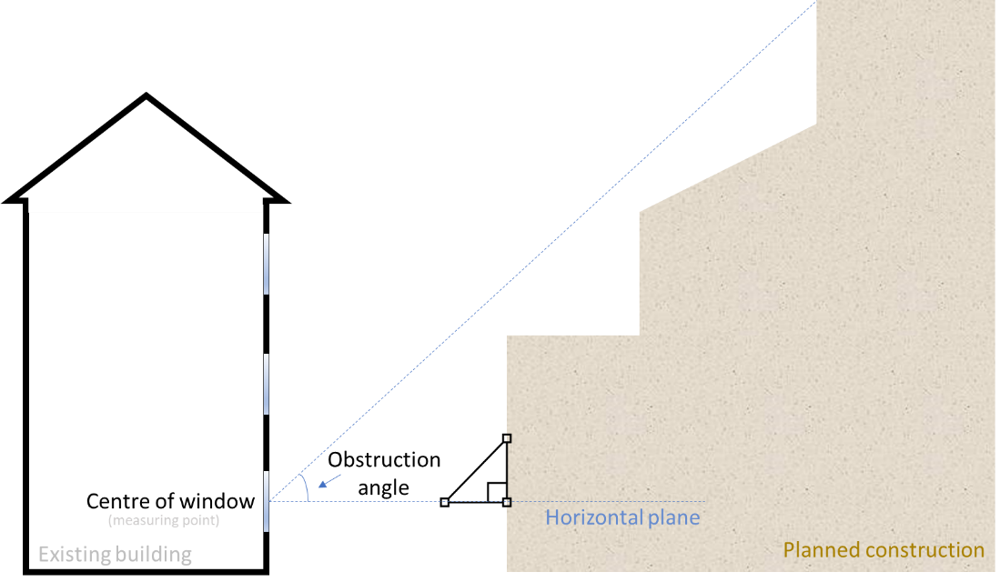
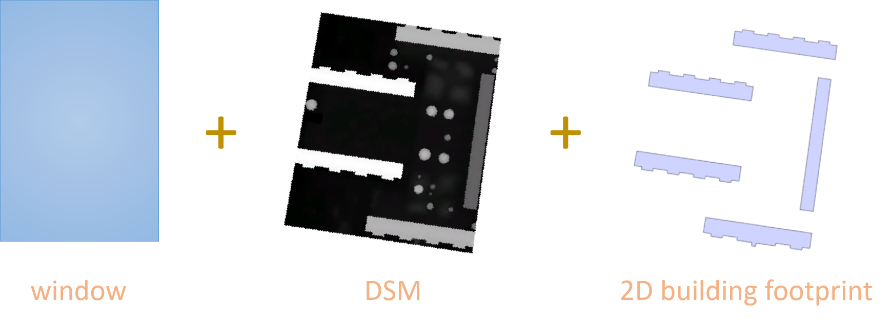
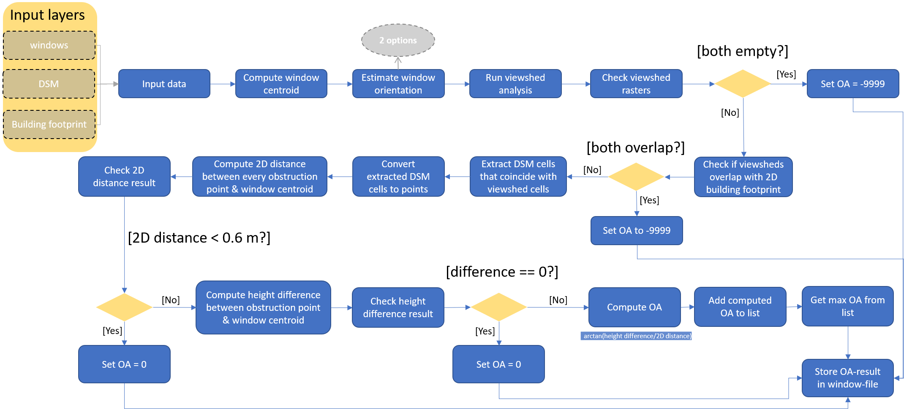
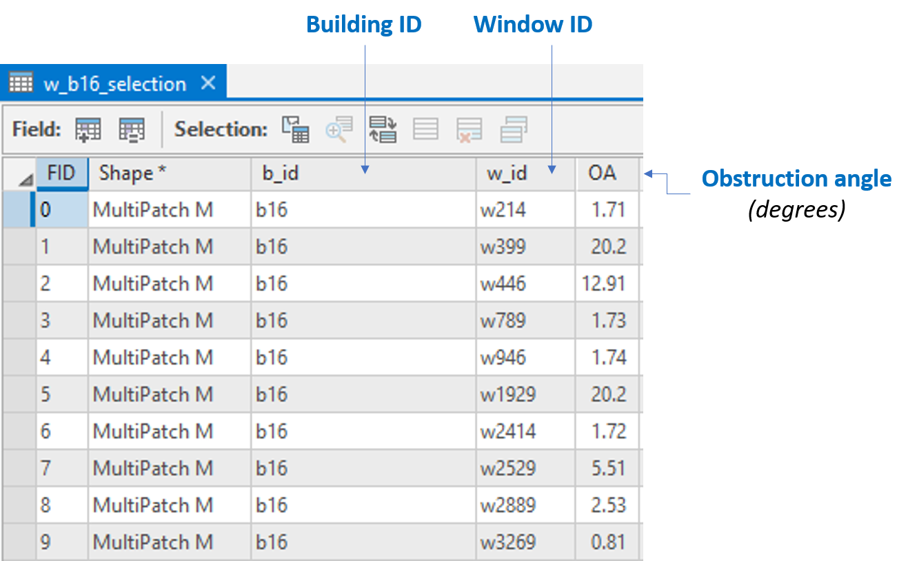

# Obstruction Angle tool (OA-tool)
The OA-tool computes the obstruction angle of rectangular windows placed on vertical surfaces of 3D buildings. The code is written in ArcPy and requires an installed version of ESRI ArcGIS Pro to run.   
 
 

## Obstruction Angle definition:
Obstruction angle is defined as the angle between the horizontal plane and a line connecting, e.g., the center point of a window and the highest point of an obstruction (see figure below).
 
 

</img>

 
 

## Input data:
- Windows (Multipatch feature layer)
- Digital Surface Model - DSM covering the entire extent of the study area (Raster layer)
- Building footprints (2D Feature layer)

 

</img>

 
 

## Requirements:

- An installed version of ESRI ArcGIS Pro (v. 2.8 or later) with a license allowing the use of the following tools 
  - Data Management
  - 3D Analyst
  - Spatial Analyst
  - Geoprocessing Tools

 

- **Window** input data layer needs to have the following columns:
  - **w_id** (ID that uniquely identifies every window of a building) with values like: *w1, w2, ..., wn* , where **n** the total number of windows in the building.
  - **b_id** (ID that uniquely identifies the building the windows belong to) with a value like: *b1*. This value must match with the corresponding building ID value in the building footprint layer.

 

- **Building footprint** layer must include the following column:
  - **b_id** (ID that uniquely identifies every building in the study area) with values like: *b1, b2, ..., bn*, where **n** the total number of buildings in the study area.
  
 
 

## Workflow:

</img>

 
 

## Output:
The computed obstruction angle for every window is stored in a separate column of the attribute table of the window input dataset. Obstruction angles are stored in degrees.

</img>

 
 

## License
Copyright 2023 Karolina Pantazatou, Lund University    
The 3-Clause BSD License  
https://opensource.org/licenses/BSD-3-Clause  
   
Redistribution and use in source and binary forms, with or without modification, are permitted provided that the following conditions are met:

1. Redistributions of source code must retain the above copyright notice, this list of conditions and the following disclaimer.

2. Redistributions in binary form must reproduce the above copyright notice, this list of conditions and the following disclaimer in the documentation and/or other materials provided with the distribution.

3. Neither the name of the copyright holder nor the names of its contributors may be used to endorse or promote products derived from this software without specific prior written permission.

THIS SOFTWARE IS PROVIDED BY THE COPYRIGHT HOLDERS AND CONTRIBUTORS "AS IS" AND ANY EXPRESS OR IMPLIED WARRANTIES, INCLUDING, BUT NOT LIMITED TO, THE IMPLIED WARRANTIES OF MERCHANTABILITY AND FITNESS FOR A PARTICULAR PURPOSE ARE DISCLAIMED. IN NO EVENT SHALL THE COPYRIGHT HOLDER OR CONTRIBUTORS BE LIABLE FOR ANY DIRECT, INDIRECT, INCIDENTAL, SPECIAL, EXEMPLARY, OR CONSEQUENTIAL DAMAGES (INCLUDING, BUT NOT LIMITED TO, PROCUREMENT OF SUBSTITUTE GOODS OR SERVICES; LOSS OF USE, DATA, OR PROFITS; OR BUSINESS INTERRUPTION) HOWEVER CAUSED AND ON ANY THEORY OF LIABILITY, WHETHER IN CONTRACT, STRICT LIABILITY, OR TORT (INCLUDING NEGLIGENCE OR OTHERWISE) ARISING IN ANY WAY OUT OF THE USE OF THIS SOFTWARE, EVEN IF ADVISED OF THE POSSIBILITY OF SUCH DAMAGE.

